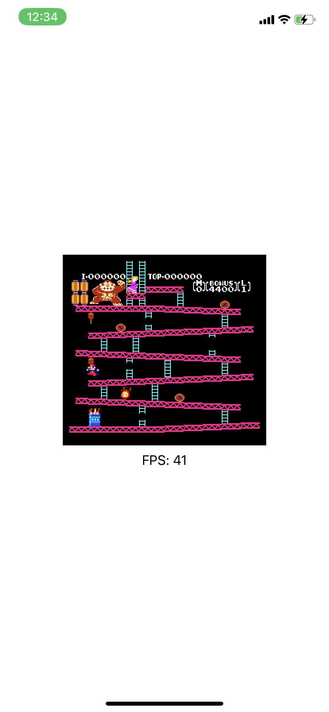

# NES_EMU
NES_EMU with swift

 7/27 
  1.correct pulseWave implementation
  2.Add keyboard control
    "a": Left
    "d": Right
    "s": Down
    "w": Up
    "o": A
    "p": B
    "n": Select
    "m": Start
  <a href="https://www.youtube.com/shorts/792qbxuuFA4">影片</a>
    

 7/24 support display for ios.
  

not playable

