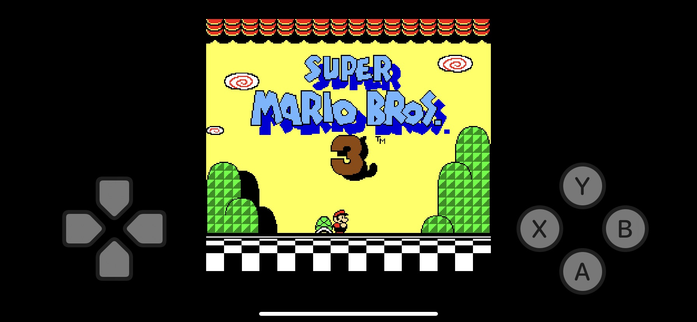
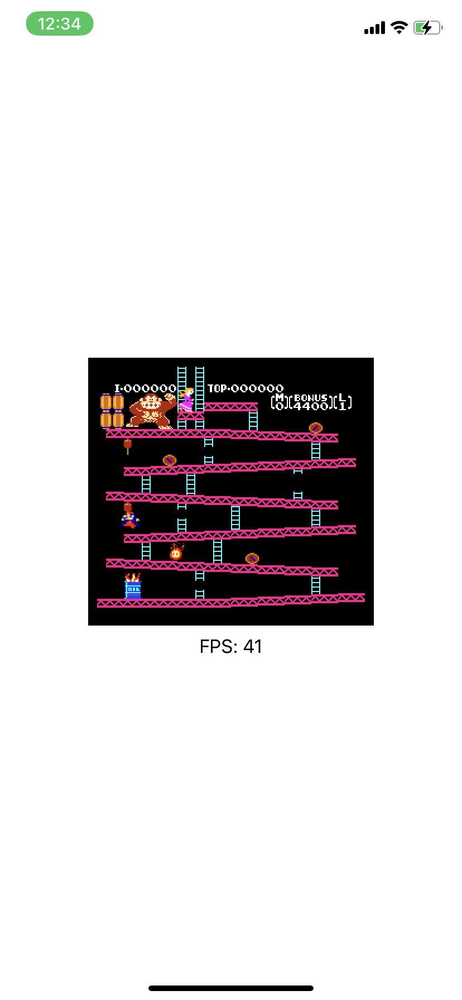
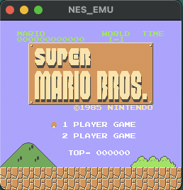

# NES_EMU
Practice implement NES emu with swift ,  just for fun

# Ref
- https://github.com/amaiorano/nes-emu
- NES 模拟器开发教程 14 - APU 方波(https://www.jianshu.com/p/43498c487ce8 )
  
# Change log

## 8/11/2023
- 1.Support Mapper4.
- 2.Add Virtual Game Controller for iOS
- 3.[Hack] change sprite limit per line from 8 to 64 
  > 
    <a href="https://www.youtube.com/watch?v=kpTZFsyE5VQ">Demo video</a>
## 7/27/2023
-  1.correct pulseWave implementation
-  2.Add keyboard control for OSX
    - "a": Left
    - "d": Right
    - "s": Down
    - "w": Up
    - "o": A
    - "p": B
    - "n": Select
    - "m": Start
## 7/24/2023
- 1.Support display for ios.
  > 
  > 
